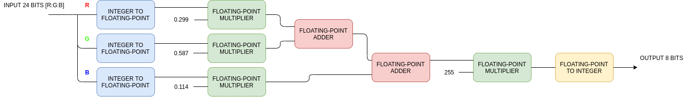
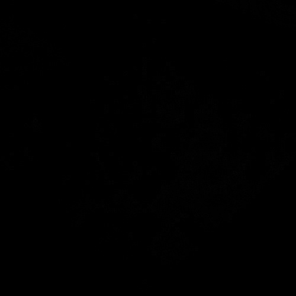

# Assignment Week #2 & #3

## 1. Tasks

Create and simulate a colourspace converter **(RGB ⇌ Greyscale)** using Python and Verilog, and then compare the two results.

* Input: an image
* Output: three images
  * one is the result from Python
  * one is from Verilog
  * one is the difference between the former two.

## 2. Algorithm

RGB[A] to Grey: ```Y ← 0.299 × R + 0.587 × G + 0.114 × B```

## 3. Plan

### 3.1. Python
- [x] Image to Bitmap Text Converter
- [x] Bitmap Text to Image Converter
- [x] RGB ⇌ Greyscale Converter
- [x] Images comparator

### 3.2. Verilog
- [x] Floating-point adder
- [x] Floating-point multiplier
- [x] RGB ⇌ Greyscale Converter
- [x] Testbench

## 4. Circuit Diagram


## 5. Image
The image we use (500 px × 500 px):


## 6. Results on Images

 |  | 
:-:|:-:|:-:
Result from Verilog | Result from Python | Difference

## 7. How to use?

Use the command `./run -i <path_to_image_file>` or `./run --image <path_to_image_file>` to run.

For videos, use the command `./run -v <path_to_video_file>` or `./run --video <path_to_video_file>`

Type `./run -h` or `./run --help` for more information on how to use.