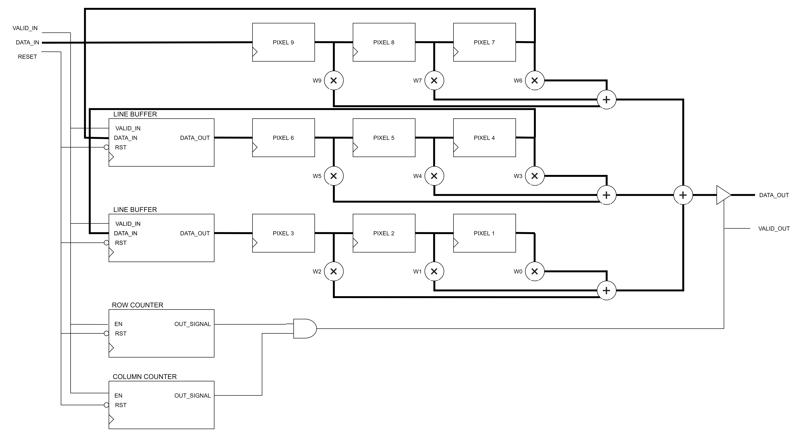

# IMEPLEMENT OBJECT DETECTION ON FPGA USING CONVOLUTIONAL NEURAL NETWORK WITH YOLO MODEL

## 1. Overview

### Features of YOLO

- YOLO, an object detection algorithm finds all objects in an image grid simultaneously
- Uses a single convolutional network for full image
- YOLO sees the entire image during training and test time so it implicitly encodes contextual information about classes as well as their appearances, unlike the sliding window or region-based techniques. Thus making less than half the number of background errors compared to Fast R-CNN.
- YOLO uses features from the entire image to predict each bounding box. It also predicts all bounding boxes across all classes for an image simultaneously. Predicts the bounding boxes and the class probabilities for these boxes.
- Treats detection as a regression problem
- Extremely fast and accurate

### Working of YOLO

- YOLO takes an image and split it into an SxS grid. Each grid cell predicts only one object
- Image classification and localization is applied on each grid
- If the center of an object falls into a grid cell, that grid cell is responsible for detecting that object
- Each of the grid cells predicts B bounding boxes with confidence scores for those boxes

### Network design of YOLO v1

YOLO’s detection network has 24 convolutional layers followed by 2 fully connected layers.

- Input: `448 × 448 × 3`
- Parameters: `65 252 682`

YOLO uses a linear activation function for the final layer and a leaky rectified linear activation (ReLU) for all other layers.

### Understanding Output of YOLO

- **pc** defines the presence of an object in the grid and is the probability. When an object is present it contains probability and when there is no object present in the grid them pc will be zero
- **bx, by, bh, bw** specify the bounding box when an object is present. **bx, by** is center of the box relative to the bounds of the grid cell. **bw, bh** are the width and height relative to the whole image
- **c1, c2, c3 etc.** represent the classes. Dimension for **c** is equal to the number of classes. Class probabilities are conditioned on the grid cell containing objects, P(class|object). If an object is present in the grid cell then class that is present will have a value of 1 and other classes will be 0

***What will be the dimension of the output?***

- Divide the image into an `S × S` grid.
- Each grid cell predicts B bounding boxes, confidence for those boxes, and C class probabilities.
- Each bounding box consists of 5 predictions: bx, by, bw, bh, and confidence
- Output dimension will `S × S × (B ∗ (1 + 4) + C)` tensor

**For example,** if we divide the image into a grid of `7 x 7` and each grid cell predicts 2 bounding boxes and we have 20 labelled classes then the output would be `7 x 7 x (2 * 5 + 20) = 7 x 7 x 30` tensors

### Network design of YOLO v3 tiny

### Limitations of YOLO

- YOLO imposes strong spatial constraints on bounding box predictions since each grid cell only predicts two boxes and can only have one class and this limits the number of nearby objects that the model can predict
- YOLO struggles with small objects that appear in groups, such as flocks of birds
- Struggles to generalise to objects in new or unusual aspect ratios or configurations

## 2. Goal

PASCAL VOC2012 Dataset is used for training the net to detect 20 classes:

Num | Class | Num | Class
:-:|:-:|:-:|:-:
0 | aeroplane | 10 | dining table
1 | bicycle | 11| dog
2 | bird | 12 | horse
3 | boat | 13 | motorbike
4 | bottle | 14 | person
5 | bird | 15 | potted plant
6 | car | 16 | sheep
7 | cat | 17 | sofa
8 | chair | 18 | train
9 | cow | 19 | TV monitor

YOLO v3 Tiny is used.

## 3. Content

### 3.1. Implementation

STATUS  | LAYER | TYPE        | FILTERS | SIZE/STRIDE
:------:|:-----:|:-----------:|:-------:|:-----------:
DONE | 0     | Convolution | 16      | 3x3/1
DONE    | 1     | Maxpool     |         | 2x2/2
DONE | 2     | Convolution | 32      | 3x3/1
DONE    | 3     | Maxpool     |         | 2x2/2
DONE | 4     | Convolution | 64      | 3x3/1
DONE    | 5     | Maxpool     |         | 2x2/2
DONE | 6     | Convolution | 128     | 3x3/1
DONE    | 7     | Maxpool     |         | 2x2/2
DONE | 8     | Convolution | 256     | 3x3/1
DONE    | 9     | Maxpool     |         | 2x2/2
DONE | 10    | Convolution | 512     | 3x3/1
DONE    | 11    | Maxpool     |         | 2x2/2
DONE | 12    | Convolution | 1024    | 3x3/1
ONGOING | 13    | Convolution | 256     | 1x1/1
DONE | 14    | Convolution | 512     | 3x3/1
ONGOING | 15    | Convolution | 255     | 1x1/1
ONGOING | 16    | YOLO        |         |
ONGOING | 17    | Route 13    |         |
ONGOING | 18    | Convolution | 128     | 1x1/1
ONGOING | 19    | Up-sampling |         | 2x2/1
ONGOING | 20    | Route 19 8  |         |
ONGOING | 21    | Convolution | 256     | 3x3/1
ONGOING | 22    | Convolution | 255     | 1x1/1
ONGOING | 23    | YOLO        |         |

#### 3.1.1. Convolution Unit for 3 × 3 kernel with stride = 1

#### 3.1.2. Maxpool Unit (2 × 2 / 2)

### 3.2. Results & Conclusion

    3.3. Reference Link:
https://qiita.com/tayutayufk/items/4dba4087e6f06fec338b
https://pjreddie.com/darknet/yolo/
https://github.com/ultralytics/yolov3
https://phamdinhkhanh.github.io/2020/03/10/DarknetGoogleColab.html
